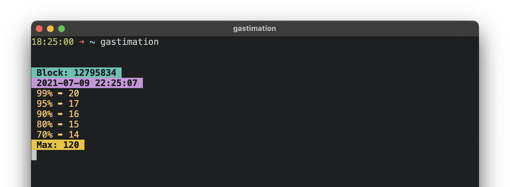

# gastimation ⛽️

<a href="https://crates.io/crates/gastimation">
  
</a>




Gastimation is a way to get mempool driven block level gas estimations in your shell. 

Blocknative has done an awesome job building their [Blocknative Gas Platform](https://www.blocknative.com/gas-platform) and this app is just an interface for their Gas Estimation product. To learn more about how this number is calculated check out: [Blocknatives Docs](https://docs.blocknative.com/gas-platform)

## Installation

```bash
cargo install gastimation
```

## Usage

```bash
gastimation
# Estimations will start streaming below
```